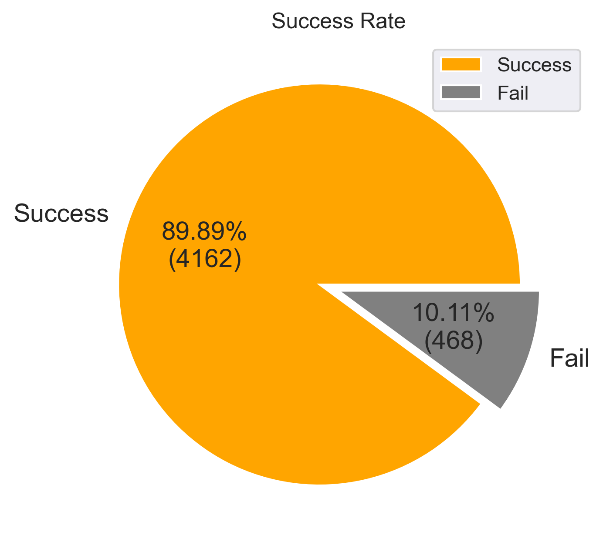
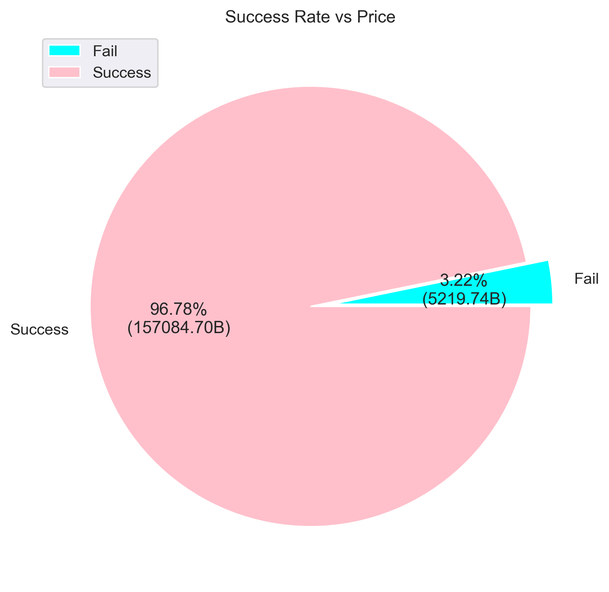
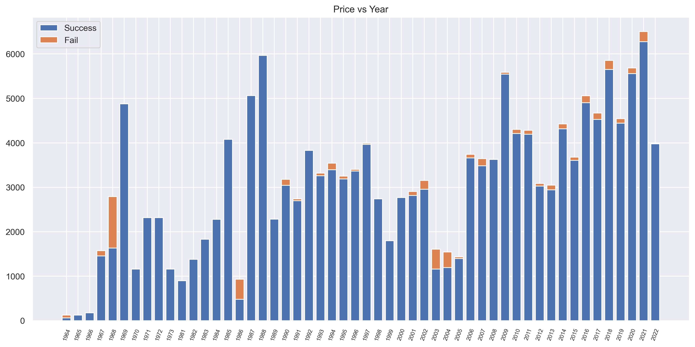
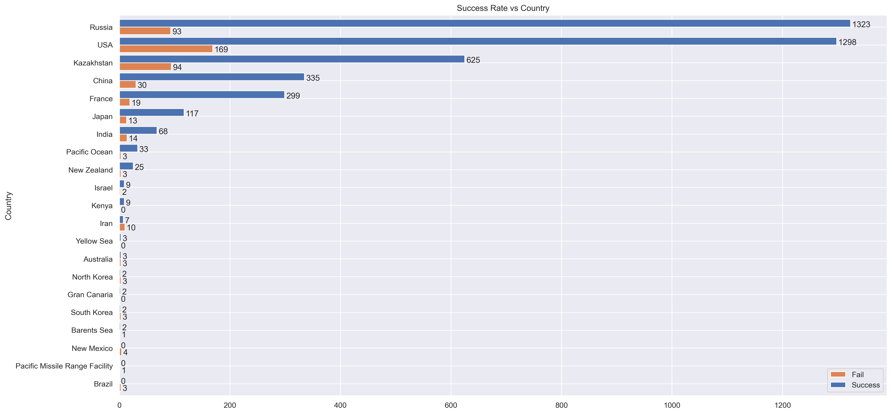
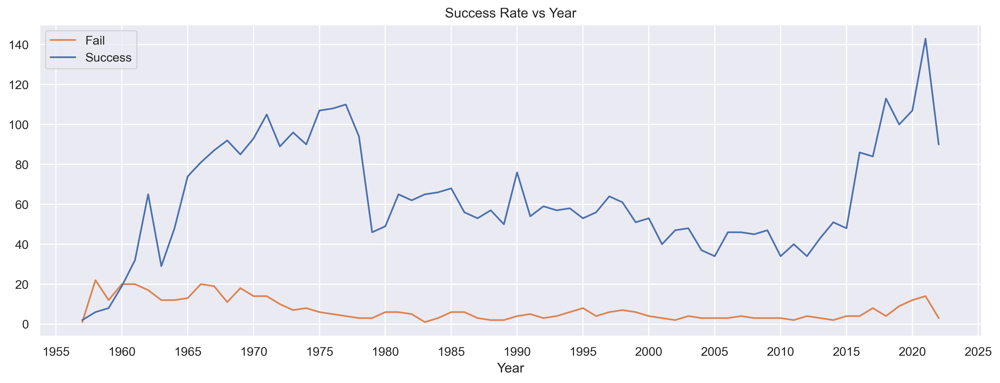
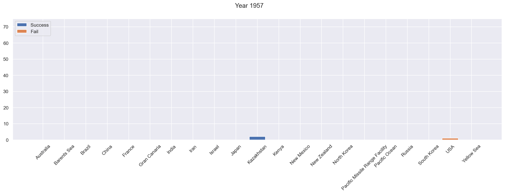

# DADS5001_Mini-Project
Success rate and trend of Space Mission since 1957 to 2022

# Author
Natchapat Youngchoay  
ID: 6420422013  
Subject: DADS5001  

# Dataset Information
File Name: space_missions.csv  
Source: https://www.kaggle.com/datasets/mysarahmadbhat/space-missions  
Total:
- 4630 Rows
- 9 Columns
   - Company
   - Location 
   - Date 
   - Time
   - Rocket
   - Mission
   - RocketStatus
   - Price
   - MissionStatus 

# Analysis Question
1. What is the relationship between success rate of space missions and country, launch year, and prices?
   - The graph shows the answer, for example, that the year around 1988 used a high price to launch a satellite, while 2021 was the most successful year.
2. What is the trend of mission success year by year?
   - Mission success is increasing year by year. However, in year range of 1980–2010, the launch rate is kind of lower than before 1980 and will be high again in 2021.
   
# Graph
 
- Graph01: Mission Success Rate

 
- Graph02: Success Rate per Price

 
- Graph03: Price per Year

 
- Graph04: Success Rate per Country

 
- Graph05: Success Rate per Year

 
 
- Trend of mission success rate per country year by year

# Journey
- Look for datasets related to an interesting topic (satellite) and select dataset 'space_missiion' from kaggle.
- Explore a column and look for a question in the data.
- Create draft version of plotted graph from question.
- Start doing programming
   - Separete Year from Date column.
   - Separate Country from Location column.
   - Set MissionStatus to Success and Fail(Failure, Partial Failure, Prelaunch Failure)
   - Analyze data
      - Data of Success and Fail mission numbers (pie graph1)
      - Relationship between Success Rate and Price (pie graph2)
      - Relationship between Success Rate, Price and Year (bar graph3)
      - Relationship between Success Rate and Country (bar graph4)
      - Relationship between Success Rate and Year (line graph5)
      - Relationship between Success Rate, Year and Country (bar graph6)
   - While import and clean dataset, author found that price data in years before 1964 was unavailable. Consequently, analyzing data with price will have fewer data points than other fields.
   - Last set in location refers to country, but some locations are in the sea or set as other places (need to google and set value) 
   - Plotting multiple graphs causes data relationship confusion
   - A lot of information (refer to Graph5) that displays the relationship between success rate, country, and year. As a result, the author employs a GIF file to display the years one by one.
- Create repository.
- Create presentation.
