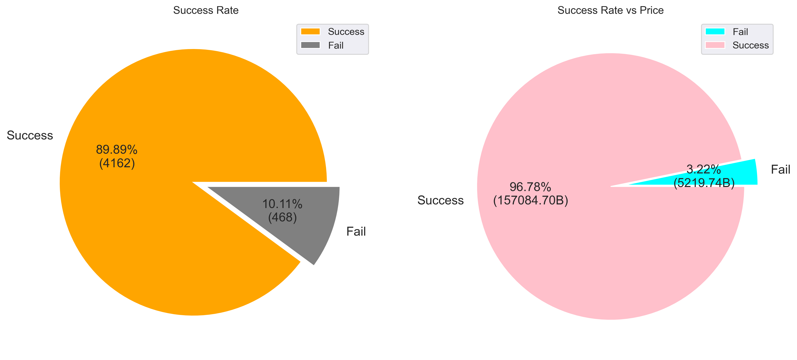
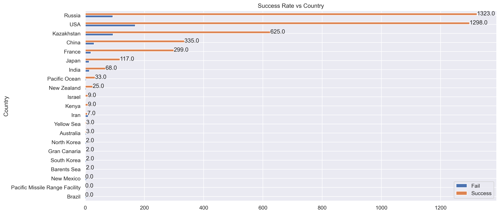
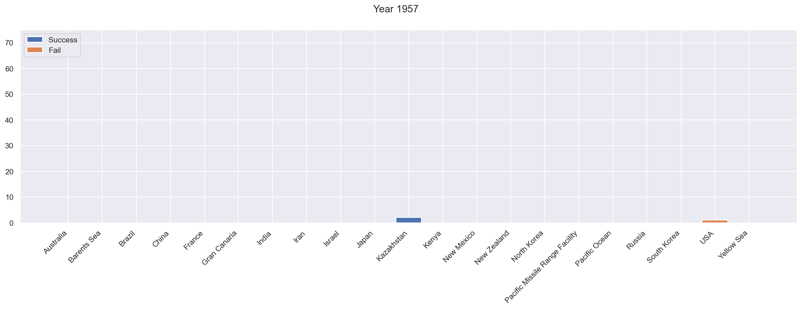

# DADS5001_Mini-Project
Success rate and prices trend of Space Mission since 1957 to 2022

# Author
Natchapat Youngchoay  
ID: 6420422013  
Subject: DADS5001  

# Dataset Information
File Name: space_missions.csv  
Source: https://www.kaggle.com/datasets/mysarahmadbhat/space-missions  
Total:
- 4630 Rows
- 9 Columns
   - Company
   - Location 
   - Date 
   - Time
   - Rocket
   - Mission
   - RocketStatus
   - Price 
   - MissionStatus 

# Analysis Question
1. What is the relationship between success rate of space missions and country, launch year, and prices?
2. What is the trend of mission success year by year?

# Issue
- Price data in Year before 1964 is unavailable, therefore analyze data with price will have less data that other fields
- Last set in location is refer to country, but some location is in a sea or set as other place (need to google and set value)
- A lot of information (refer to Graph6) that display relationship between success rate,country and year. Therefore author using GIF file to display year by year

# Graph

 

 

 

 
 
- Trend of mission success year by year

